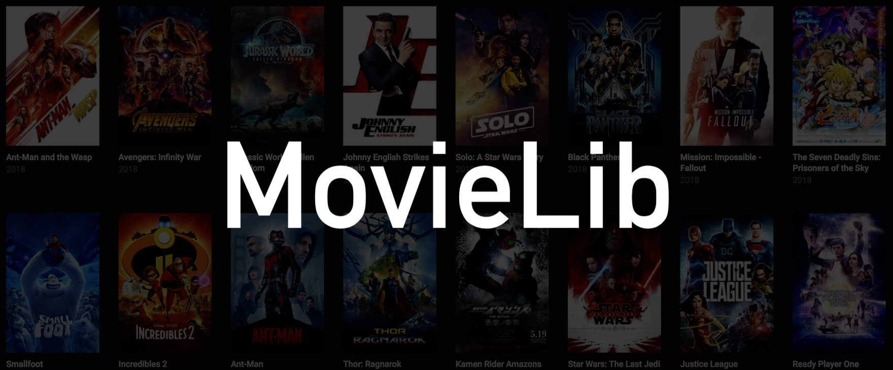
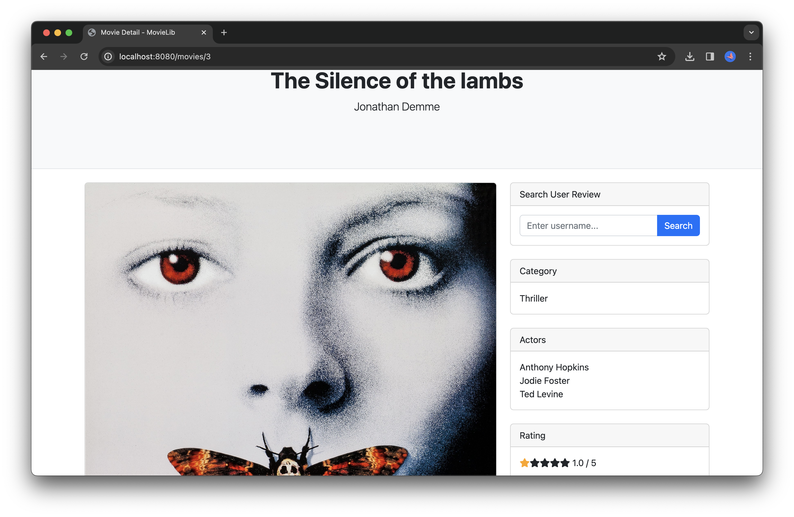

[](./res/movielib-home.png)

<!-- ABOUT THE PROJECT -->
## About The Project

MovieLab is a web application that allows users to search for their favorite films, 
view detailed movie summaries and write reviews.

### Built With

* [![Spring][Spring.io]][Spring-url]
* [![Maven][Maven.com]][Maven-url]
* [![JUnit][JUnit.com]][JUnit-url]
* [![PostgreSQL][PostgreSQL.org]][PostgreSQL-url]

<!-- GETTING STARTED -->
## Getting Started

### Prerequisites

A local database running on PostgreSQL.

### Installation

Launch backend
```sh
cd backend/
./mvnw compile exec:java
```

Launch test
```sh
cd backend/
./mvnw compile test
```

<!-- USAGE -->
## Usage

- Create an account
- Add a new Movie
- Add a new Review to a movie

[](./res/movielib-homepage-screenshot.png)
[](./res/movielib-detail-screenshot.png)
[](./res/movielib-detail-screenshot2.png)

<!-- CONTACT -->
## Contact

Reda Meziane - reda.meziane99@gmail.com

Project Link: [https://github.com/MovieLib](https://github.com/RedaMez/MovieLib)

<p align="right">(<a href="#readme-top">back to top</a>)</p>

<!-- MARKDOWN LINKS & IMAGES -->
<!-- https://www.markdownguide.org/basic-syntax/#reference-style-links -->
[Spring.io]: https://img.shields.io/badge/spring-6DB33F?style=for-the-badge&logo=spring&logoColor=white
[Spring-url]: https://spring.io
[Maven.com]: https://img.shields.io/badge/Maven-C71A36?style=for-the-badge&logo=apachemaven&logoColor=white
[Maven-url]: https://apache.org
[JUnit.com]: https://img.shields.io/badge/JUnit5-25A162?style=for-the-badge&logo=junit5&logoColor=white
[JUnit-url]: https://junit.org
[PostgreSQL.org]: https://img.shields.io/badge/postgresql-4169E1?style=for-the-badge&logo=postgresql&logoColor=white
[PostgreSQL-url]: https://postgresql.org
